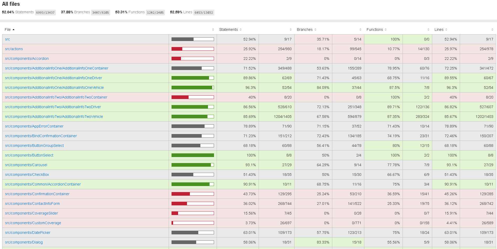
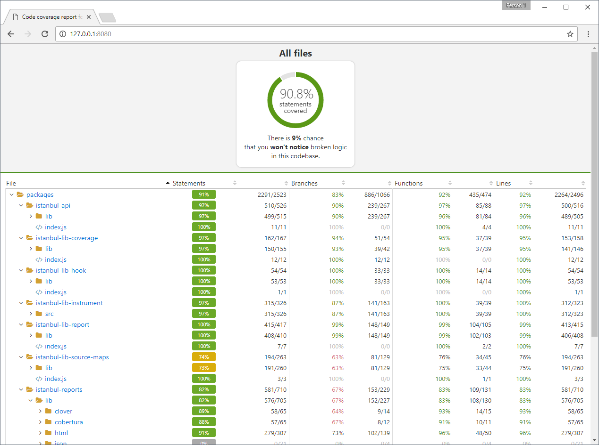
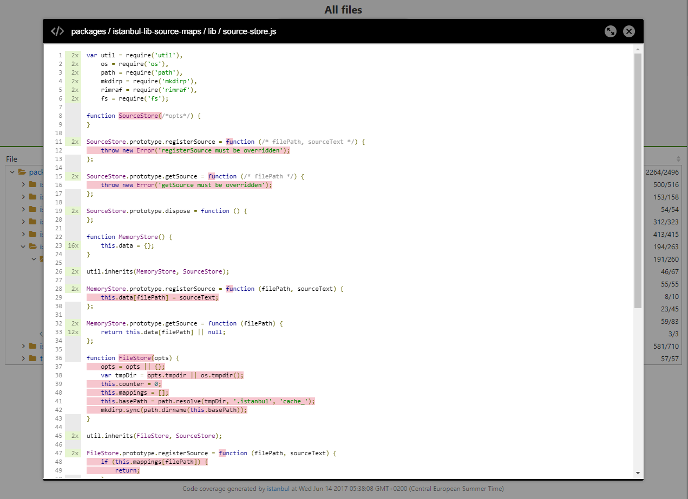
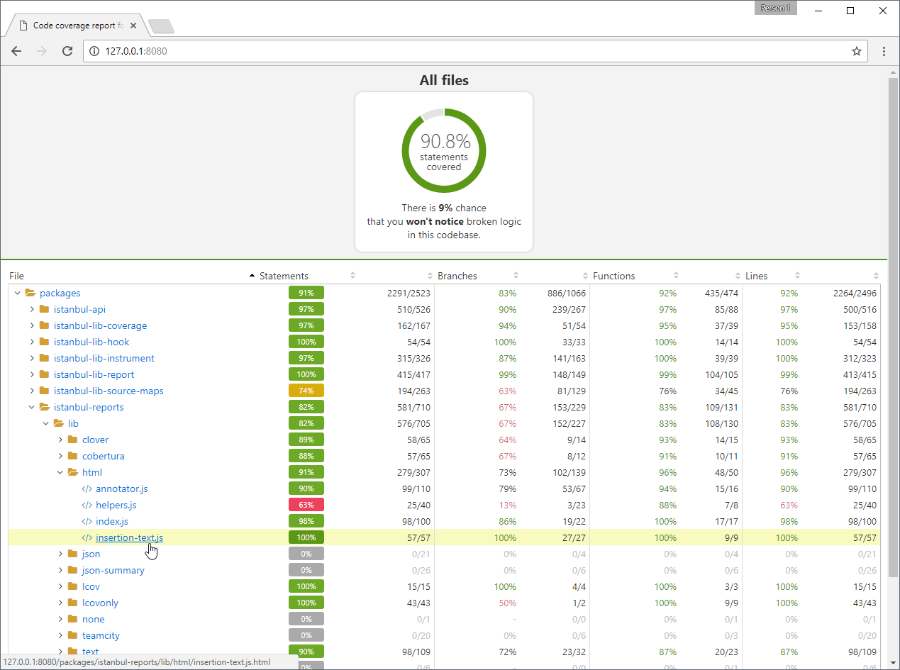

# Hacky override on Istanbul HTML report with UX tweaks

Check out **[live demo](http://istanbul-report-demo.surge.sh/)**

---

## Problems with current design

- hard to read, left align flat list
- navigation between static pages, loosing context

## New design

- tree structure
- opening file coverage in modal dialog
- summary chart with meaningful info/warning

### Known issues/limitations of current implementation

- iziModal behavior when displaying report in iframe
- missing routing (cannot share link to an open modal)
- report should rather be served on the server in order to fetch all pages

---

